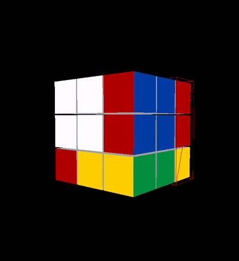
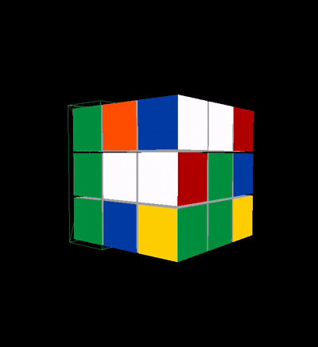
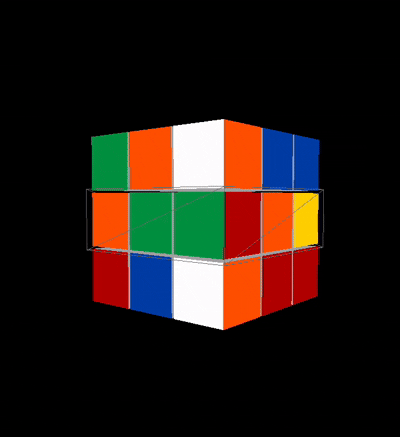

# RubiksMaster

Interactive 3D Rubik’s Cube visualizer and trainer built with React and Three.js.

## Features

- Full 3×3 cube rendered with Three.js cubies and ambient lighting.
- Face and middle-layer selection via color-coded controls.
- Animated quarter-turn rotations (clockwise / counter-clockwise) with 1 or 2 turn options.
- Shuffle button with live cancel (`Stop`) to watch or interrupt scrambles.
- Solve button replays the inverse of all recorded moves (manual or shuffle) so you see every step.
- Highlight overlay tracks the currently selected layer.
- Orbit camera (drag to inspect) with zoom disabled for a fixed scale.

## Demo

| Select & Rotate | Auto Shuffle | Solve Playback |
| --------------- | ------------ | -------------- |
|  |  |  |

> **Note:** drop the three GIFs (`cube-rotate.gif`, `cube-shuffle.gif`, `cube-solve.gif`) into the `assets/` folder to have them render in the README.

## Requirements

- Node.js 18+ (recommended: latest LTS)
- npm (bundled with Node)

## Setup

```bash
git clone <repository-url>
cd RubiksMaster/cubemaster
npm install
```

## Development

```bash
npm start
```

This launches the CRA dev server at http://localhost:3000 with hot reload enabled.

## Build

```bash
npm run build
```

Creates a production build in `cubemaster/build`.

## Testing

```bash
npm test
```

Runs the Jest + React Testing Library suite in watch mode.

## Project Structure

```
RubiksMaster/
├── README.md
├── package.json
├── cubemaster/
    ├── package.json
    ├── src/
        ├── App.js
        ├── components/
            ├── RubiksCube.js
            └── styles/
                └── RubiksCube.css
```

The root `package.json` tracks shared dependencies (e.g., Three.js), while the CRA app lives under `cubemaster/`.

## Key Files

- `cubemaster/src/components/RubiksCube.js`
  - Sets up the Three.js scene, cubies, orbit controls, and rotation logic.
  - Manages shuffle/solve sequences and the move history stack.
- `cubemaster/src/components/styles/RubiksCube.css`
  - Layout for the control panel + canvas, chip buttons, segmented controls, and buttons.

## Credits

- React and Create React App
- Three.js for WebGL rendering
- OrbitControls from `three/examples/jsm/controls/OrbitControls`

## License

MIT © 2025 Your Name

